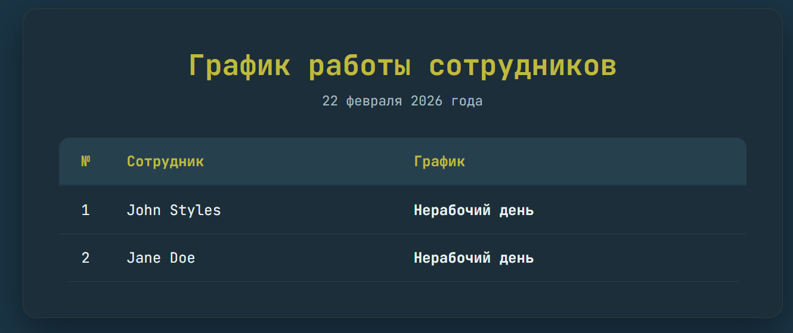
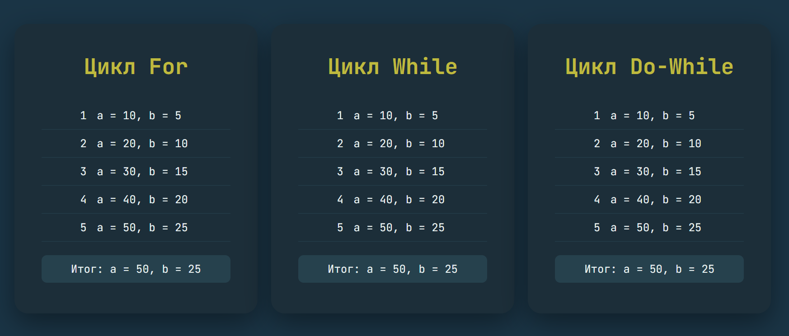

# Лабораторная работа №3. Управляющие конструкции

## Цель работы

Освоить использование условных конструкций и циклов в PHP.

--- 

### Подготовил : student Kirov Kiril IA-2404
### Проверил : lector Universitar Vișnevschi Boris

## Условие

### Условные конструкции

1. Используя функцию `date()`, создайте таблицу с расписанием, формируемым на основе текущего дня недели.

| №   | Фамилия Имя | График работы |
| --- | ----------- | ------------- |
| 1   | John Styles | xx - xx       |
| 2   | Jane Doe    | yy - yy       |

<br>

- Для `John Styles` (xx - xx):
  - Если текущий день недели — **понедельник, среда или пятница**, выведите график работы **8:00-12:00**.
  - В остальные дни недели выведите текст: **Нерабочий день**.
- Для `Jane Doe` (yy - yy):
  - Если текущий день недели — **вторник, четверг или суббота**, выведите график работы **12:00-16:00**.
  - В остальные дни недели выведите текст: **Нерабочий день**.


## Описание функции 
`date(string $format, ?int $timestamp = null): string`

Функция возвращает отформатированную по заданной строке формата строку с датой и (или) временем, которую сгенерировала на основе параметра timestamp — целочисленной метки Unix-времени, которую передали в функцию или которую функция получила на основе текущего системного времени, если метку времени не передали.

 Поэтому параметр timestamp необязателен и по умолчанию равен значению, которое возвращает функция time().

## **Реализуем**
напишем массив из интов с днями нелели в которые сотрудники работают. подготовим массив для удобного вывода даты месяца на русском.

```php
<?php
$John_working_days = [1,3,5];
$jane_working_days = [2,4,6];

$months = [
    1 => 'января', 'февраля', 'марта', 'апреля', 'мая', 'июня',
    'июля', 'августа', 'сентября', 'октября', 'ноября', 'декабря'
];

```
Создадим переменную $current_date  которая хранит в себе сегодняшнюю дате в формате `22 февраля 2026 года`.

``` php
$current_date = date('d') . ' ' . $months[date('n')] . ' ' . date('Y') . ' года';
$today = date("N");
?>
```
Для получения необходимого элемента даты по параметру воспользуемся вспомогательной табличкой с сайта w3schools:
https://www.w3schools.com/php/func_date_date.asp

* d - The day of the month (from 01 to 31)
* D - A textual representation of a day (three letters)
* j - The day of the month without leading zeros (1 to 31)
* l (lowercase 'L') - A full textual representation of a day
* N - The ISO-8601 numeric representation of a day (1 for Monday, 7 for Sunday)
* S - The English ordinal suffix for the day of the month (2 characters st, nd, rd or th. Works well with j)
* w - A numeric representation of the day (0 for Sunday, 6 for Saturday)
* z - The day of the year (from 0 through 365)
* W - The ISO-8601 week number of year (weeks starting on Monday)
* F - A full textual representation of a month (January through December)
* m - A numeric representation of a month (from 01 to 12)
* M - A short textual representation of a month (three letters)
* n - A numeric representation of a month, without leading zeros (1 to 12)
* t - The number of days in the given month
* L - Whether it's a leap year (1 if it is a leap year, 0 otherwise)
* o - The ISO-8601 year number
* Y - A four digit representation of a year
* y - A two digit representation of a year
* a - Lowercase am or pm
* A - Uppercase AM or PM
* B - Swatch Internet time (000 to 999)
* g - 12-hour format of an hour (1 to 12)
* G - 24-hour format of an hour (0 to 23)
* h - 12-hour format of an hour (01 to 12)
* H - 24-hour format of an hour (00 to 23)
* i - Minutes with leading zeros (00 to 59)
* s - Seconds, with leading zeros (00 to 59)
* u - Microseconds (added in PHP 5.2.2)
* e - The timezone identifier (Examples: UTC, GMT, Atlantic/Azores)
* I (capital i) - Whether the date is in daylights savings time (1 if Daylight Savings Time, 0 otherwise)
* O - Difference to Greenwich time (GMT) in hours (Example: +0100)
* P - Difference to Greenwich time (GMT) in hours:minutes (added in PHP 5.1.3)
* T - Timezone abbreviations (Examples: EST, MDT)
* Z - Timezone offset in seconds. The offset for timezones west of UTC is negative (-43200 to 50400)
* c - The ISO-8601 date (e.g. 2013-05-05T16:34:42+00:00)
* r - The RFC 2822 formatted date (e.g. Fri, 12 Apr 2013 12:01:05 +0200)
* U - The seconds since the Unix Epoch (January 1 1970 00:00:00 GMT)


## Включаем в **html**

```html
<!doctype html>
<html lang="ru">
<head>
    <meta charset="UTF-8">
    <meta name="viewport" content="width=device-width, initial-scale=1.0">
    <title>График работы</title>
    <link rel="stylesheet" href="style.css">
</head>
<body>

<div class="container">
    <h1>График работы сотрудников<br>
        <span><?= $current_date ?></span>
    </h1>

    <table>
        <tr>
            <th>№</th>
            <th>Сотрудник</th>
            <th>График</th>
        </tr>

        <tr>
            <td>1</td>
            <td>John Styles</td>
            <td class="schedule">
                <?= in_array($today, $John_working_days) ? "8:00-12:00" : "Нерабочий день" ?>
            </td>
        </tr>

        <tr>
            <td>2</td>
            <td>Jane Doe</td>
            <td class="schedule">
                <?= in_array($today, $jane_working_days) ? "12:00-16:00" : "Нерабочий день" ?>
            </td>
        </tr>

    </table>
</div>

</body>
</html>
```

```php
<td class="schedule">
                <?= in_array($today, $jane_working_days) ? "12:00-16:00" : "Нерабочий день" ?>
            </td>
```


`<?= - альтарнатива <?php echo`

****in_array()**** - возвращает находится ли элемент в массиве. Мы эту функцию используем для проверки работает сотрудник или нет, и в зависимости от результата выводим необходимую информацию (график)

Для компактного вывода используем унарный оператор ?, если True то первая интструкция, иначе - вторая.



### **Циклы**

1. Создайте файл `index.php` со следующим кодом:

   ```php
   <?php

   $a = 0;
   $b = 0;

   for ($i = 0; $i <= 5; $i++) {
       $a += 10;
       $b += 5;
   }

   echo "End of the loop: a = $a, b = $b";
   ```

2. Добавьте вывод промежуточных значений `$a` и `$b` на каждом шаге цикла.

3. Перепишите этот цикл, используя оператор `while` и `do-while`.

### While

```php
            <?php
            $a = 0;
            $b = 0;
            $i = 0;
        echo "<div class='values'>";
            while ($i < 5) {
                $a += 10;
                $b += 5;
                echo "<li>
                        <span class='num'>".($i+1)."</span>
                        <span class='text'>a = {$a}, b = {$b}</span>
                    </li>";
                $i++;
            }
            echo "</div>";

            echo "<div class='result'>Итог: a = $a, b = $b</div>";
            ?>
```
### Do-While

```php
 <?php
            $a = 0;
            $b = 0;
            $i = 0;
        echo "<div class='values'>";
            do {
                $a += 10;
                $b += 5;
                echo "<li>
                        <span class='num'>".($i+1)."</span>
                        <span class='text'>a = {$a}, b = {$b}</span>
                    </li>";
                $i++;
            } while ($i < 5);
        echo "</div>";

            echo "<div class='result'>Итог: a = {$a}, b = {$b}</div>";
?>
```



## Контрольные вопросы

1. В чем разница между циклами `for`, `while` и `do-while`? В каких случаях лучше использовать каждый из них?
---

**for** - Используется, когда мы заранее знаем, сколько раз нужно выполнить цикл.
Обычно применяем для перебора по счетчику.

for ($i = 0; $i < $n; $i++) {
    echo $i;
}

**while**
Работает, пока условие истинно.
Сначала проверяется условие, потом выполняется код.

Лучше использовать, когда заранее неизвестно, сколько раз выполнится цикл (например, пока пользователь не введет правильное значение).

**do-while**
Сначала выполняет код, потом проверяет условие.

Подходит, когда нужно, чтобы код выполнился хотя бы один раз (например, меню, которое должно показаться минимум один раз).

2. Как работает тернарный оператор `? :` в PHP?
---


Это короткая форма if-else.

*Синтаксис:*

`условие ? значение_если_true : значение_если_false;`

Пример:

```php

$age = 18;
echo ($age >= 18) ? "Совершеннолетний" : "Несовершеннолетний";

```
Если условие истинно — выполняется первая часть, если ложно — вторая.

Это просто удобная короткая запись.


3. Что произойдет, если в do-while условие изначально ложно?
---

Цикл всё равно выполнится один раз, потому что: сначала выполняется тело цикла, потом проверяется условие

Например:
```php
$i = 10;

do {
    echo $i;
while ($i < 5);

```
Здесь $i < 5 — сразу ложь,
но echo $i; выполнится один раз.

# **Вывод**

В ходе выполнения лабораторной работы я освоил использование условных конструкций и циклов в PHP.

Я научился работать с функцией date() для получения текущей даты и дня недели, а также применять массивы для хранения рабочих дней сотрудников. С помощью функции in_array() и тернарного оператора ? : реализовал вывод графика работы в зависимости от текущего дня.

Также я закрепил знания по циклам for, while и do-while, понял разницу между ними и научился выводить промежуточные значения переменных на каждом шаге цикла.

Таким образом, цель лабораторной работы достигнута — я освоил применение управляющих конструкций в PHP на практике.

