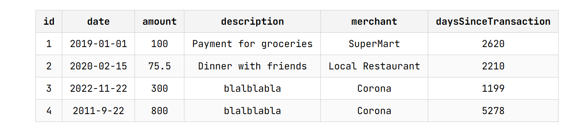
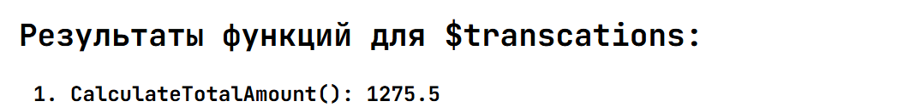
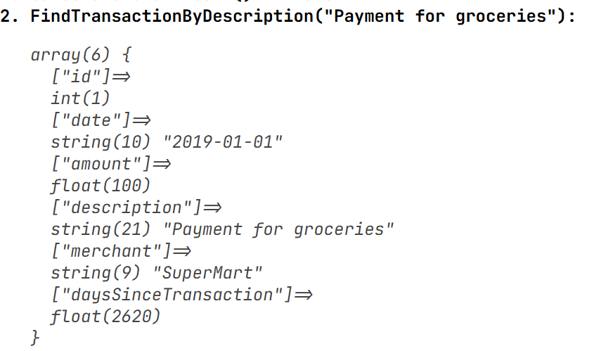
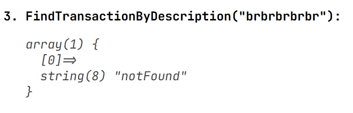
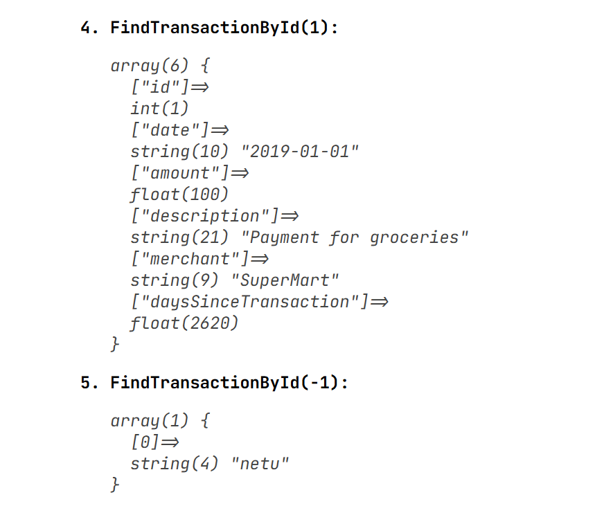
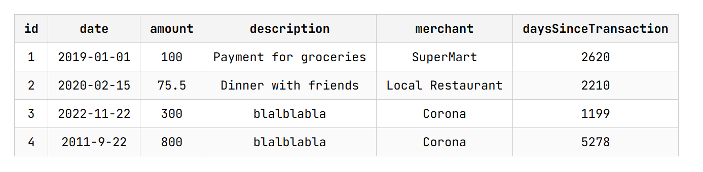
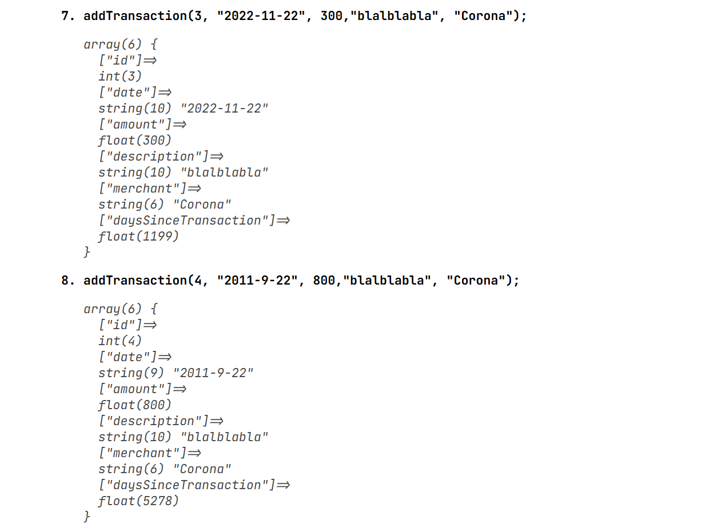
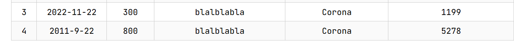

# Лабораторная работа №4 PHP
## Массивы и Функции

### Цель работы
Я должен освоить работу с массивами в PHP, применяя различные операции: создание, добавление, удаление, сортировка и поиск. Закрепить навыки работы с функциями, включая передачу аргументов, возвращаемые значения и анонимные функции.

## Условие
### Задание 1. Работа с массивами
Я должен разработать систему управления банковскими транзакциями с возможностью:

- добавления новых транзакций;
- удаления транзакций;
- сортировки транзакций по дате или сумме;
- поиска транзакций по описанию.

## Задание 1.1. Подготовка среды

```php
<?php

declare(strict_types=1);
```

Должен быть самой первой строкой файла (после <?php)
Включает строгую типизацию аргументов функций.

```php
declare(strict_types=1);

function sum(int $a, int $b) {
    return $a + $b;
}

sum("5", "3");
```

## Задание 1.2. Создание массива транзакций
Создаю массив $transactions, содержащий информацию о банковских транзакциях. Каждая транзакция представлена в виде ассоциативного массива с полями:

- id – уникальный идентификатор транзакции;
- date – дата совершения транзакции (YYYY-MM-DD);
- amount – сумма транзакции;
- description – описание назначения платежа;
- merchant – название организации, получившей платеж.

### Наш массив:
$transactions = [
    [
        "id" => 1,
        "date" => "2019-01-01",
        "amount" => 100.00,
        "description" => "Payment for groceries",
        "merchant" => "SuperMart",
    ],
    [
        "id" => 2,
        "date" => "2020-02-15",
        "amount" => 75.50,
        "description" => "Dinner with friends",
        "merchant" => "Local Restaurant",
    ],
];

## Задание 1.3. Вывод списка транзакций
Я использую foreach, чтобы вывести список транзакций в HTML-таблице.
Пример таблицы:
```html
<table border='1'>
<thead>
    <tr>
        <!-- Заголовки столбцов -->
    </tr>
</thead>

<tbody>
<!-- Вывод транзакций -->
</tbody>

</table>
```

## Моя Реализация
```php
<table>
<thead>
    <tr>
        <?php
        foreach (array_keys($transactions[0]) as $key) {
            echo "<th>$key</th>";
        }
        ?>
    </tr>
</thead>

<tbody>
<?php
foreach ($transactions as $transaction) { //проходимся по транзакциям
    echo "<tr>";

    foreach ($transaction as $value) { // проходимся по значениям
        echo "<td>$value</td>";
    }

    echo "</tr>";
}
?>
</tbody>
</table>
```



## Задание 1.4. Реализация функций
**Создаем и используем следующие функции:**

1. Создаем функцию `calculateTotalAmount(array $transactions): float`  
которая:
- вычисляет общую сумму всех транзакций.  

- Выведите сумму всех транзакций в конце таблицы.
```php
/**
 * @param array $transactions
 * @return float
 * @description - calculates the total amount of transactions (field = ["amount"])
 */
function calculateTotalAmount(array $transactions): float { //Инициализация функции
    $sum = 0; //переменная, хранящая сумму
    foreach ($transactions as $transaction) //проходимся по каждому элементу массива
     {
        $sum += $transaction["amount"];//к общей сумме добавляем значение суммы транзакций
    }

    return $sum;

}
```

## Используем в документе
```html
<h2>Результаты функций для $transcations:</h2>
    
    <ol>
        <li>CalculateTotalAmount(): <?= calculateTotalAmount($transactions) ?>
        </li>
```   

### Результат:


### 2. findTransactionByDescription(string $descriptionPart)
```php

/**
 * Ищет транзакцию по части описания
 *
 * @param string $descriptionPart
 * @return array|null
 */

function findTransactionByDescription(string $descriptionPart): ?array {
    global $transactions;

    foreach ($transactions as $transaction) {
        if (strpos($transaction["description"], $descriptionPart) !== false) {
            return $transaction;
        }
    }

    return null;
}
```

strpos() — это функция в PHP, которая ищет позицию подстроки внутри строки.

Синтаксис
strpos(string $string, string $needle, int $offset = 0): int|false
Параметры

$string — строка, в которой ищем

$needle — что ищем

$offset — с какого символа начинать поиск (необязательно)

strpos() проверяет, содержится ли подстрока:
strpos("Payment for groceries", "grocer") 

***Также можно использовать***

```php

if (str_contains($transaction["description"], $descriptionPart)) {
    return $transaction;
}   

```     




```php
        <li>FindTransactionByDescription("Payment for groceries"):
            <?php
            echo "<pre>";
            var_dump(findTransactionByDescription("Payment for groceries"));
            echo "</pre>";
            ?>
        </li>
        <li>FindTransactionByDescription("brbrbrbrbr"):
            <?php
            echo "<pre>";
            var_dump(findTransactionByDescription("brbrbrbrbr"));
            echo "</pre>";
            ?>
        </li>
```

### 3. FINDTRANSACTIONBYID
**1. Через foreach**
```php
/**
 * @param int $id
 * @return array|null
 */
function findTransactionById(int $id): ?array {
    global $transactions;

    foreach ($transactions as $transaction) {
        if ($transaction["id"] === $id) {
            return $transaction;
        }
    }

    return null;
}
```


**2. Через Filter**
```php
/**
 * @param int $id
 * @return array|null
 */
function findTransactionById(int $id): ?array {
    global $transactions;

    $result = array_filter($transactions, function ($transaction) use ($id) {
        return $transaction["id"] === $id;
    });

    return $result ? array_values($result)[0] : null;
}
```

### Как работает array_filter?
```php
array_filter($transactions, function ($transaction) use ($id) {

array_filter проходит по массиву и оставляет только те элементы, для которых функция (у нас анонимная) возвращает true.
```

`use` нужен, чтобы передать переменную из внешней области видимости внутрь анонимной функции в PHP.

Анонимная функция **не видит** переменные снаружи автоматически.

## Почему нужен array_values

После array_filter ключи сохраняются:

[3 => [...]]

`array_values()` делает:

[0 => [...]]

чтобы можно было взять первый элемент.


Вывод:
```php
        <li>FindTransactionById(1):
            <?php
            echo "<pre>";
            var_dump(findTransactionById(1));
            echo "</pre>";
            ?>

        </li>

        <li>FindTransactionById(-1):
            <?php
            echo "<pre>";
            var_dump(findTransactionById(-1));
            echo "</pre>";
            ?>

        </li>
```        



4.## daysSinceTransaction(string $date): int, которая возвращает количество дней между датой транзакции и текущим днем.
Добавим в таблицу столбец с количеством дней с момента транзакции.

```php
/**
 * @param string $date
 * @return array[]
 */
function daysSinceTransaction (string $date) {
    global $transactions;
    $todayDate = strtotime($date); //переданная дата в секундах
    foreach ($transactions as &$transaction) {
        $transactionDate = strtotime($transaction["date"]); //дата транзакции в секундах
        $transaction["daysSinceTransaction"] = floor(($todayDate - $transactionDate) / 86400); //количество прошедших дней
    }
    return $transactions;
}
```

Для корректного отображения используем ДО `<!Doctype html>`

Новый столбец - days Since Transaction


### присваиваем чтобы явно переопределить массив
он не обязателен, но улучшает использование функции, функция теперь НЕ **dirty**

```php
$transactions = daysSinceTransaction("2026-03-05");
```

5. ## Функция добавить транзанкию

```php
/**
 * @param int $id
 * @param string $date
 * @param float $amount
 * @param string $description
 * @param string $merchant
 * @return void
 */
function addTransaction(int $id, string $date, float $amount, string $description, string $merchant): void {
    global $transactions;// массив транзакций

    foreach ($transactions as $transaction) {
        if ($transaction["id"] === $id) {
            echo "Ошибка: Транзакция с ID $id уже существует.<br>";
            return; //проверяем униклаьность айди
        }
    }
    $transactions[] = [ //array[] - добавляем в конец транзакцию по параметрам переданным в функцию
        "id" => $id,
        "date" => $date,
        "amount" => $amount,
        "description" => $description,
        "merchant" => $merchant
    ];
}
```

```php
addTransaction(3, "2022-11-22", 300,"blalblabla", "Corona");
addTransaction(4, "2011-9-22", 800,"blalblabla", "Corona");
```





## Задание 1.5. Сортировка транзакций
- Отсортируйте транзакции по дате с использованием usort().
- Отсортируйте транзакции по сумме (по убыванию).

### Вспомогательная Функция для вывода массива в виде таблицы
```php
function renderTable(array $transactions) {
    echo "<table>";
    echo "<thead><tr>";
    foreach (array_keys($transactions[0]) as $key) {
        echo "<th>$key</th>";
    }
    echo "</tr></thead><tbody>";

    foreach ($transactions as $transaction) {
        echo "<tr>";
        foreach ($transaction as $value) {
            echo "<td>$value</td>";
        }
        echo "</tr>";
    }

    echo "</tbody></table><br>";
}
?>
```

```php
usort($transactions, function($a, $b) {
    return strtotime($a['date']) <=> strtotime($b['date']);
});
```

usort используется для сортировки ассоциативных массивов.

usort сам не умеет сортировать, ему нужно передать callback функцию

<=> - spaceship оператор, работает как компаратор
дает:
* -1 если меньше
* 0 если равны
* 1 если больше


## Задание 2. Работа с файловой системой
Создаю директорию "image", в которой сохраните не менее 20-30 изображений с расширением .jpg.
Затем создаю файл index.php, в котором определяю веб-страницу с хедером, меню, контентом и футером.
Вывожу изображения из директории "image" на веб-страницу в виде галереи.


```php
    <div class="content">
        <?php
        $dir = "image/";
        $files = scandir($dir);

        if ($files === false) return;
        for ($i = 0; $i < count($files); $i++) {
        if (($files[$i] != ".") && ($files[$i] != "..")) {
                $path = $dir . $files[$i];
                echo '<div class = "image" style = "background-image: url(' . $path . ')"></div>';
            }
        }
        ?>
    </div>
```
# Контрольные вопросы
1. Что такое массив в PHP?
Массив — это переменная, которая может хранить несколько значений сразу.
Например: список чисел, строк или даже других массивов.
```php
$numbers = [1, 2, 3, 4];
```
Ассоциативный массив — это массив, у которого ключи могут быть строками, а не только числа.

### Пример

```php
$person = [
    "name" => "Alex",
    "age" => 25,
    "city" => "Chisinau"
];
```


2. Как создать массив в PHP?

Есть два основных способа.

Через [] (современный способ):

$fruits = ["apple", "banana", "orange"];

Через array() (старый способ):

$fruits = array("apple", "banana", "orange");

echo $person["name"]; // Alex
echo $person["age"];  // 25

3. Для чего используется цикл foreach?

foreach нужен, чтобы перебирать элементы массива.

```php
$numbers = [1, 2, 3];

foreach ($numbers as $number) {
    echo $number;
}

foreach ($person as $key => $value) {
    echo "$key: $value\n";
}

//name: Alex
//age: 25
//city: Chisinau
```

Он проходит по каждому элементу массива и позволяет работать с ним.


йоу 😎