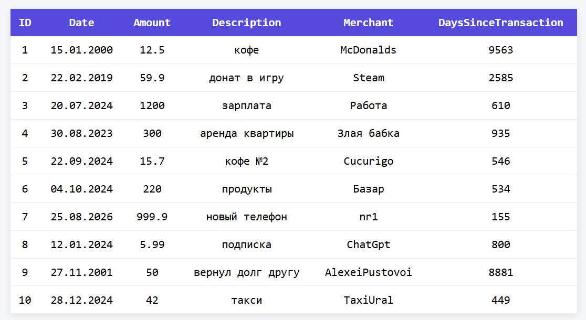
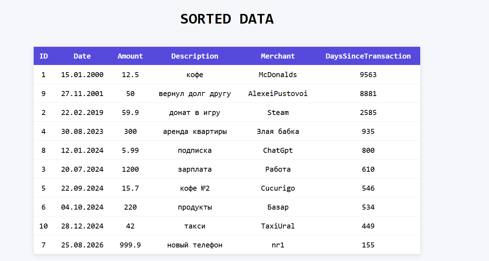
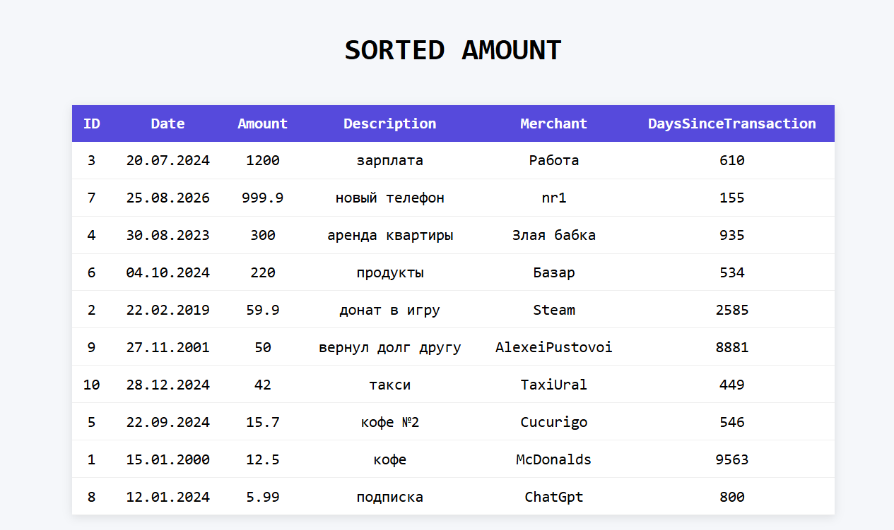
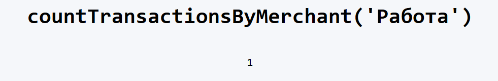

# Лабораторная работа №5. Объектно-ориентированное программирование в PHP

## Цель работы
Я должен основы объектно-ориентированного программирования в PHP на практике. А также научиться создавать собственные классы, использовать инкапсуляцию для защиты данных, разделять ответственность между классами, а также применять интерфейсы для построения гибкой архитектуры приложения

## Задание 1: Включение строгой типизации
```php
<?php
declare(strict_types=1);
```

## Задание 2: Класс Transaction
 описывает одну банковскую транзакцию.

### Моя Реализация

```php
<?php
declare(strict_types=1);

/**
 * Transaction
 * {int $id, DateTime $date, float $amount, string description,string $merchant}
 */
class Transaction
{
private int $id;
private DateTime $date;
private float $amount;
private string $description;

private string $merchant;

    /**
     * @param int $id
     * @param DateTime $date
     * @param float $amount
     * @param string $description
     * @param string $merchant
     */
public function __construct(int $id, DateTime $date, float $amount, string $description, string $merchant) {
    $this->id = $id;
    $this->date = $date;
    $this->amount = $amount;
    $this->description = $description;
    $this->merchant = $merchant;
}

    /**
     * @return int
     */
public function getId(): int {
    return $this->id;
}

    /**
     * @return DateTime
     */
public function getDate(): DateTime {
    return $this->date;
}

    /**
     * @return float
     */
public function getAmount(): float {
    return $this->amount;
}

    /**
     * @return string
     */
public function getDescription(): string {
    return $this->description;
}

    /**
     * @return string
     */
public function getMerchant(): string {
    return $this->merchant;
}

    /**
     * @return int
     */
public function getDaysSinceTransaction(): int {
    $now = new DateTime();
    return $now->diff($this->date)->days;
}

}
```

## Задание 4. Класс TransactionManager
TransactionManager будет использовать TransactionRepository для выполнения бизнес-логики.

TransactionManager не должен создавать транзакции самостоятельно и не должен хранить их внутри себя. Объект TransactionRepository необходимо передать в TransactionManager через конструктор

```php
<?php

class TransactionManager
{
    /**
     * @param TransactionRepository $repository
     */
    public function __construct(private TransactionRepository $repository) {
    }

    /**
     * @return float
     */
    public function calculateTotalAmount(): float {
        $sum = 0;
        foreach($this->repository->getAllTransactions() as $transaction) {
            $sum += $transaction->getAmount();
        }
        return $sum;
    }

    /**
     * @param Datetime $startDate
     * @param DateTime $endDate
     * @return float
     */
    public function calculateTotalAmountByDateRange(Datetime $startDate, DateTime $endDate): float {
        $sum = 0;
        foreach($this->repository->getAllTransactions() as $transaction) {
            if($transaction->getDate() >= $startDate && $transaction->getDate() <= $endDate) {
                $sum += $transaction->getAmount();
            }
        }
        return $sum;
    }

    /**
     * @param string $merchant
     * @return int
     */

    public function countTransactionsByMerchant(string $merchant): int {
        $count = 0;
        foreach($this->repository->getAllTransactions() as $transaction) {
            if($transaction->getMerchant() === $merchant) {
                $count++;
            }
        }
        return $count;
    }

    /**
     * @return array
     */
    public function sortTransactionsByDate(): array {
            $new_arr = $this->repository->getAllTransactions();
            usort($new_arr, fn($a, $b) => $a->getDate() <=> $b->getDate());
            return $new_arr;
        }

    /**
     * @return array
     */
    public function sortTransactionsByAmountDesc() : array {
        $new_arr = $this->repository->getAllTransactions();
        usort($new_arr, fn($a, $b) =>
            $b->getAmount() <=> $a->getAmount());
        return $new_arr;
    }
}
```

## Задание 5. Класс TransactionTableRenderer
TransactionTableRenderer отвечает только за вывод транзакций в HTML. Этот класс должен получать список транзакций и формировать HTML-таблицу.

```php
<?php

class TransactionTableRenderer
{
        public function render(array $transactions): string
        {
            $html = '<div class="table-container">';
            $html .= '<table>';

            $html .= '
        <thead>
        <tr>
            <th>ID</th>
            <th>Date</th>
            <th>Amount</th>
            <th>Description</th>
            <th>Merchant</th>
            <th>DaysSinceTransaction</th>
        </tr>
        </thead>
        <tbody>
        ';

            foreach ($transactions as $t) {
                $html .= '<tr>';
                $html .= '<td>' . $t->getId() . '</td>';
                $html .= '<td>' . $t->getDate()->format("d.m.Y") . '</td>';
                $html .= '<td>' . $t->getAmount() . '</td>';
                $html .= '<td>' . $t->getDescription() . '</td>';
                $html .= '<td>' . $t->getMerchant() . '</td>';
                $html .= '<td>' . $t->getDaysSinceTransaction() . '</td>';
                $html .= '</tr>';
            }

            $html .= '</tbody></table></div>';

            return $html;
        }
    }
```
## Задание 6 Начальные данные
Создаю 10 объектов Transaction. Каждая транзакция должна содержать:

- разные даты;
- разные суммы;
- разные описания;
- разных получателей.

### index.php
```php
//подключаем все Классы и Интерфейсы
spl_autoload_register(function ($class) {
    require_once $class . '.php';
});


$data = [
    [1, "2000-01-15", 12.5, "кофе", "McDonalds"],
    [2, "2019-02-22", 59.9, "донат в игру", "Steam"],
    [3, "2024-07-20", 1200, "зарплата", "Работа"],
    [4, "2023-08-30", 300, "аренда квартиры", "Злая бабка"],
    [5, "2024-09-22", 15.7, "кофе №2", "Cucurigo"],
    [6, "2024-10-04", 220, "продукты", "Базар"],
    [7, "2026-08-25", 999.9, "новый телефон", "nr1"],
    [8, "2024-01-12", 5.99, "подписка", "ChatGpt"],
    [9, "2001-11-27", 50, "вернул долг другу", "AlexeiPustovoi"],
    [10, "2024-12-28", 42, "такси", "TaxiUral"],
];

$transactions = [];

foreach ($data as $item) {
    $transactions[] = new Transaction(
        $item[0],
        new DateTime($item[1]),
        $item[2],
        $item[3],
        $item[4]
    );
}

$tableRenderer = new TransactionTableRenderer();
echo $tableRenderer->render($transactions);

echo '<br><hr><br>';
$transactionRepository = new TransactionRepository($transactions);
$transactionManager = new TransactionManager($transactionRepository);
echo $transactionManager->calculateTotalAmount(). "<br>";
echo $transactionManager->calculateTotalAmountByDateRange(new DateTime("2000-12-01"),new DateTime("2024-12-08"));

echo "<br><hr><br> <h1>SORTED DATA</h1> <br>";
$transactions = $transactionManager->sortTransactionsByDate();
echo $tableRenderer->render($transactions);

echo "<br><hr><br> <h1>SORTED AMOUNT</h1> <br>";
$transactions = $transactionManager->sortTransactionsByAmountDesc();
echo $tableRenderer->render($transactions);
echo "<h1>countTransactionsByMerchant('Работа')</h1> <br>";
echo $transactionManager->countTransactionsByMerchant("Работа");
```

## Результаты


### GetTotalAmount && getAmountByDateRange()








## Задание 7 Интерфейс TRANSACTION STORAGE INTERFACE

```php
<?php

interface TransactionStorageInterface
{
public function addTransaction(Transaction $transaction): void;
public function removeTransactionById(int $id): void;
public function getAllTransactions(): array;
public function findById(int $id): ?Transaction;
}

```
```php
<?php
class TransactionRepository implements TransactionStorageInterface {
```


```php
<?php
class TransactionManager
{
    /**
     * @param TransactionStorageInterface $repository
     */
    public function __construct(private TransactionStorageInterface $repository) {
    }
    ...
}    

```

# Контрольные вопросы

**1. Зачем нужна строгая типизация в PHP?**

- Строгая типизация - когда хотим в PHP жёстко проверять типы данных для предотвращения ошибок, неявных преобразований, простой отладки, лучшего понимания и читемости кода. Код становится безопаснее и презсказуемее.

**2. Что такое класс в ООП**

Класс — это шаблон (модель), по которому создаются объекты. Он содержит поля для описания структуры и начальных состояний, а также определяет методы для работы с обьектами.

**3. Что такое полиморфизм**

Полиморфизм — это возможность использовать один интерфейс для разных реализаций.
Например метод sayHi. Испанец скажет Hola, русский - Привет! хотя они оба являются объектами класса Person 

**4. Интерфейс vs Абстрактный класс**

**Интерфейс**

interface Repository {
    public function save($data);
}

- только сигнатуры методов
- нет реализации
- обычно не содержит свойств 
- класс может реализовать сколь угодно интерфейсов
- нет логической связи в иерархии наследования 

**Абстрактный класс**
- может содержать реализацию
- может иметь поля
- может частично реализовать логику
- нельзя наследовать несколько
- является логической частью

5. **Преимущества интерфейсов**

    1. Гибкость

- Можно сделать разные реализации:
```php
class ArrayRepository implements TransactionRepositoryInterface {}
class FileRepository implements TransactionRepositoryInterface {}
class DatabaseRepository implements TransactionRepositoryInterface {}
```

2. Лёгкая замена
3. удобно тестировать без БД
4. Чистая архитектура
- разделение ответственности
- слабая связанность (low coupling)
- код проще поддерживать

Абстрактный класс навязывает хранение данных:

protected array $transactions = [];
Нет гибкости (одно наследование)

Без интерфейса
Жёсткая зависимость от класса
function process(TransactionRepository $repo)

привязаны к конкретной реализации
Нарушение принципа DIP (Dependency Inversion)
зависимость от абстракции, а не от реализации

Нельзя легко заменить реализацию

$repo = new TransactionRepository();

чтобы сменить на БД — надо менять код везде


>Модули высокого уровня не должны зависеть от модулей низкого уровня.
Оба должны зависеть от абстракций.